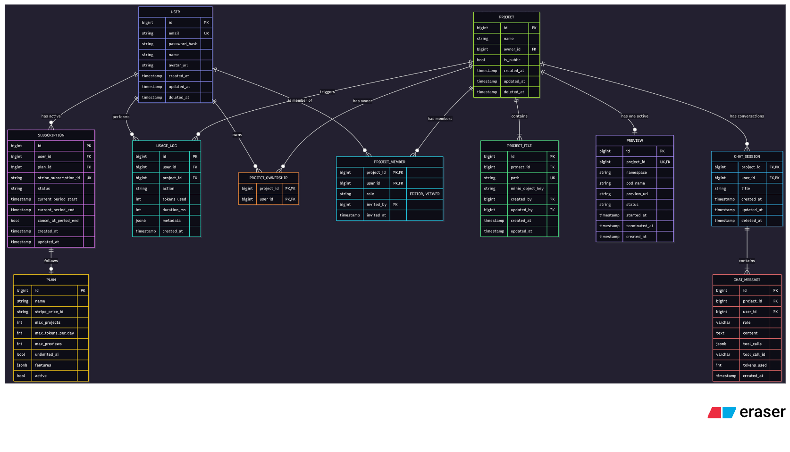

# ❤️ Lovable Clone – Backend (Spring Boot)

A backend clone of **Lovable**, built using **Spring Boot**, following clean architecture, layered design, and full REST API support.  
This project includes authentication, user profiles, posts, comments, and more.

---

## 🚀 Tech Stack

- **Java 17+**
- **Spring Boot**
- Spring Web
- Spring Data JPA
- Spring Security
- PostgreSQL
- Maven

---

## 📌 Entities Overview

> The following entities are currently implemented:
- User
- Post
- Like
- Comment
- Follower / Following
- Any additional entities you included…

---

## 🧩 ERD – Entity Relationship Diagram

Paste your ERD image below 👇

```md


